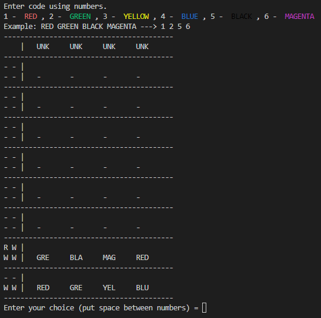
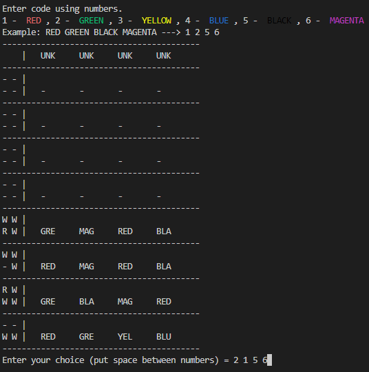
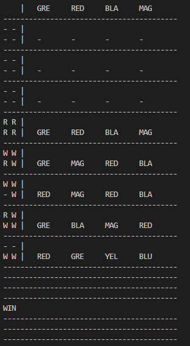

# Mastermind

In this repositorie we can find a game named mastermind that can be executed to play.

## Usage

```
$ chmod +x mastermind.py (put the file in executable)
$ ./mastermind.py
```

## Demo


<br />
<br />
<br />

<br />
<br />
<br />


## Resource

- [How to play Mastermind](https://www.youtube.com/watch?v=5jtcsBERDEQ&ab_channel=TripleSGames)
- [Mastermind in python](https://www.youtube.com/watch?v=NLfxNo7Q0Pk&ab_channel=MichaelGoddard)
- [How to print color](https://www.youtube.com/watch?v=u51Zjlnui4Y&ab_channel=TechWithTim)

## Authors

- [Colas Renard](https://www.github.com/cocofox1902)
